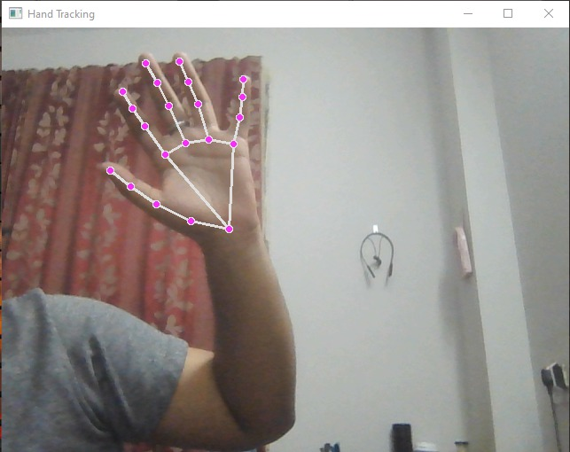
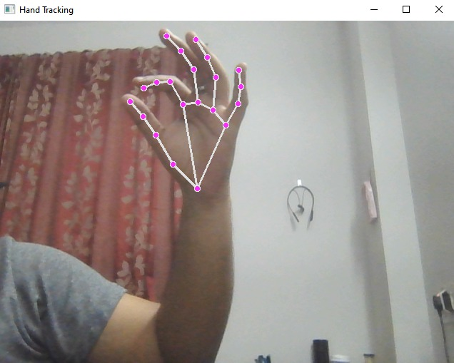

# Virtual-mouse (python 3.8.0)

This code involves using the webcam on the system to detect the user's hand and create a bounding box around it. 
By focusing on the fore finger and the thumb, the system can use the user's hand as a virtual mouse without physically touching the computer. 
The fore finger acts as the cursor, and its movement controls the movement of the mouse cursor on the screen. 
To perform a click, the system detects the distance between the fore finger and the thumb, and if they are together, it will execute a click. 
Additionally, a smoothness factor was implemented to reduce the shakiness of the mouse movement.

## Preview

## Requirements:
Following modules need to be installed for it to work properly:

- OpenCV
- Mediapipe
- Numpy
- Pyautogui

